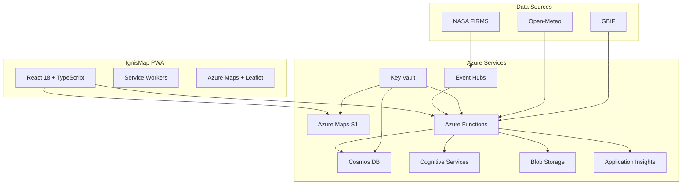

# 🔥 IgnisMap - Wildfire Prediction System [1](#1-0) 

An advanced Progressive Web Application (PWA) for wildfire prediction, monitoring, and response, built with Microsoft Azure technologies and real-time satellite data analysis.

## 🌟 Key Features

- **AI-Powered Prediction**: Intelligent analysis using Azure Cognitive Services [2](#1-1) 
- **Real-Time Satellite Data**: Integration with NASA FIRMS for active fire detection [3](#1-2) 
- **Interactive Maps**: Advanced visualization with Azure Maps and Leaflet [4](#1-3) 
- **Biodiversity Analysis**: Environmental risk assessment and endangered species evaluation [5](#1-4) 
- **Tactical Planning**: Automated response strategy generation
- **Complete PWA**: Works offline and installable on mobile devices

## 🚀 Technologies

### Frontend
- **React 18** with TypeScript
- **Vite** for optimized builds
- **Tailwind CSS** for styling
- **PWA** with service workers [6](#1-5) 

### Azure Services
- **Azure Maps** - Professional mapping services
- **Cosmos DB** - Distributed database
- **Cognitive Services** - AI and image analysis
- **Azure Functions** - Serverless processing
- **Application Insights** - Monitoring and telemetry [7](#1-6) 

### Data APIs
- **NASA FIRMS** - Active fire data
- **Open-Meteo** - Weather data
- **GBIF** - Biodiversity data
- **Microsoft Planetary Computer** - Geospatial analysis [8](#1-7) 

## 📦 Installation

### Prerequisites
- Node.js 18+
- Azure CLI
- Azure account with available credits


### 1. Clone the repository
```bash
git clone https://github.com/seojedaperez/IgnisMap.git
cd IgnisMap
```

### 2. Install dependencies
```bash
npm install
```

### 3. Prerequisites for Azure Setup
```bash
# Install Azure CLI if not already installed
# Visit: https://docs.microsoft.com/en-us/cli/azure/install-azure-cli

# Login to Azure
az login
```

### 4. Configure Azure (Automated)
```bash
# Run automated setup script
chmod +x scripts/azure-setup.sh
./scripts/azure-setup.sh
```

### 5. Configure environment variables
```bash
# The script will output the required keys at the end
# Copy them to your .env file or application configuration
```

### 6. Run in development
```bash
npm run dev
```

## 🏗️ System Architecture



## 🔧 Available Scripts

- `npm run dev` - Development server
- `npm run build` - Production build
- `npm run preview` - Build preview
- `npm run lint` - ESLint linting
- `npm run type-check` - TypeScript type checking [11](#1-10) 

## 🌍 Azure Configuration

The project includes automated scripts to configure the entire Azure infrastructure:

### Automatically Created Services
- **Resource Group**: `emergency-rg`
- **Azure Maps**: Mapping and geolocation
- **Cosmos DB**: 8 specialized containers
- **Function App**: Serverless processing
- **Cognitive Services**: AI and analysis
- **Event Hubs**: Satellite data streaming
- **Key Vault**: Secure secret management
- **Application Insights**: Monitoring [12](#1-11) 

### Estimated Costs
- **Critical Services**: $115-150/month
- **Support Services**: $50-120/month
- **Total**: ~$165-270/month USD

## 📱 PWA Features

- ✅ Installable on mobile and desktop
- ✅ Works offline
- ✅ Push notifications
- ✅ Automatic updates
- ✅ Custom icon [13](#1-12) 

## 🔥 Main Functionalities

### Emergency Dashboard
- Real-time metrics
- Active alerts
- Risk analysis
- Weather data [14](#1-13) 

### Data Analysis
- **Wind**: Pattern analysis and prediction
- **Biodiversity**: Environmental risk assessment
- **Tactical**: Automated response plans
- **Satellite**: Real-time NASA FIRMS data
- **Spread**: Fire expansion modeling

## 🚀 Deployment

### Netlify (Recommended)
```bash
npm run build:netlify
```

### Manual
```bash
npm run build
# Upload dist/ folder to your hosting
```

## 🤝 Contributing

1. Fork the project
2. Create a feature branch (`git checkout -b feature/AmazingFeature`)
3. Commit your changes (`git commit -m 'Add some AmazingFeature'`)
4. Push to the branch (`git push origin feature/AmazingFeature`)
5. Open a Pull Request

## 📄 License

This project is licensed under the MIT License - see the [LICENSE](LICENSE) file for details.

## 🙏 Acknowledgments

- **NASA FIRMS** for satellite data
- **Microsoft Azure** for cloud infrastructure
- **Open-Meteo** for weather data
- **GBIF** for biodiversity data

---

**⚠️ Important**: This system is designed to assist in emergency decision-making, but should not be the only factor considered in critical situations. Always consult with local fire management experts.
